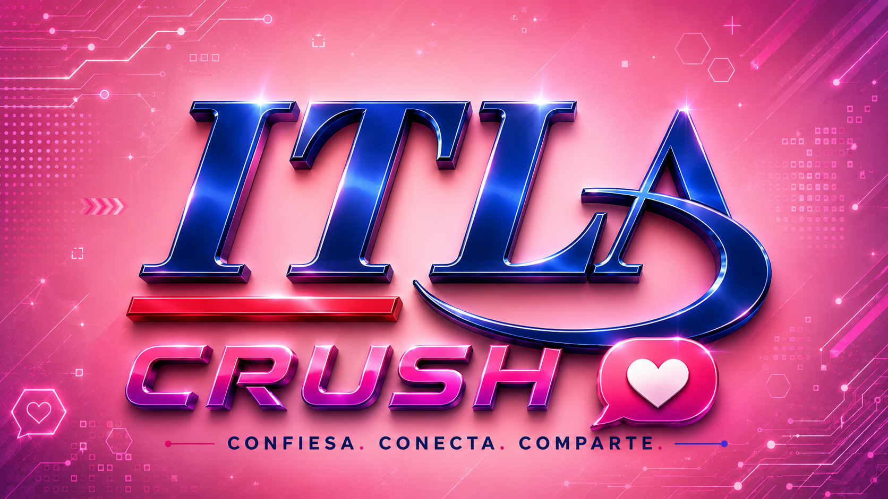

<div align="center">



<p align="center">
  
</p>

Aplicación web para publicar y consultar confesiones públicas, privadas o anónimas, desarrollada con **React**, **Vite** y **Google Firebase**.


</div>

---

## 📌 Descripción

**ITLA Crush** fue concebido originalmente como proyecto final de la asignatura **Programación WEB (SOF-011)** del Instituto Tecnológico de Las Américas (ITLA).

La aplicación permite a los usuarios publicar declaraciones dirigidas a otras personas. Cada confesión puede configurarse como:

- Pública o privada.
- Anónima o identificada.
- Dirigida a un usuario registrado o a una persona introducida manualmente.

Esta reconstrucción se desarrolla desde cero con las tecnologías requeridas originalmente por el profesor: **JavaScript ES6, React y Firebase**. El objetivo es conservar la esencia del proyecto original y llevarlo a un nivel más moderno, mantenible y adecuado para portafolio.

---

## 📚 Información académica

| Campo | Información |
|---|---|
| **Institución** | Instituto Tecnológico de Las Américas (ITLA) |
| **Asignatura** | Programación WEB |
| **Código** | SOF-011 |
| **Cuatrimestre** | 2018-C2 |
| **Profesor** | Raydelto Hernández Perera |
| **Modalidad** | Proyecto final grupal |

### 👥 Integrantes del proyecto original

| Integrante | Matrícula |
|---|---|
| Juan Alberty Fernández Durán | 2015-2724 |
| Wilmer Vásquez de León | 2015-2946 |
| Francis Jairo Matías Rosario | 2015-2984 |
| Gerson Santos Mateo | 2015-3031 |

---

## 🧭 Continuidad académica

Programación WEB fue la tercera asignatura cursada con el profesor **Raydelto Hernández Perera**, dentro de una evolución progresiva en el desarrollo de software:

| Orden | Código | Asignatura | Proyecto | Período |
|---:|---|---|---|---|
| 1 | SOF-004 | Programación II | [Eventix](https://github.com/Jairo0811/Eventix) | 2017-C2 |
| 2 | SOF-012 | Estructuras de Datos | [Aerolinea](https://github.com/Jairo0811/Aerolinea) | 2018-C1 |
| 3 | SOF-011 | Programación WEB | **ITLA Crush** | 2018-C2 |

Estos proyectos representan una secuencia académica enfocada en programación, estructuras de datos y desarrollo web, y actualmente están siendo preservados y modernizados como parte del portafolio profesional.

---

## 🎯 Objetivos

### Objetivo general

Desarrollar una aplicación web interactiva con React y Firebase que permita registrar usuarios, autenticar sesiones y publicar confesiones públicas, privadas o anónimas.

### Objetivos específicos

- Implementar registro e inicio de sesión.
- Permitir la consulta pública de confesiones visibles para todos.
- Restringir el contenido privado a usuarios autenticados.
- Permitir publicaciones anónimas o identificadas.
- Validar correctamente los formularios y datos ingresados.
- Construir una interfaz moderna, responsive y accesible.
- Organizar el código mediante componentes, servicios y responsabilidades separadas.

---

## 🚀 Funcionalidades principales

### 🌐 Usuarios no autenticados

- Consultar confesiones públicas.
- Crear una cuenta.
- Iniciar sesión.

### 🔐 Usuarios autenticados

- Crear confesiones.
- Consultar confesiones privadas.
- Seleccionar un destinatario registrado.
- Introducir manualmente otro destinatario.
- Publicar de forma anónima.
- Publicar mostrando su identidad.
- Cerrar sesión de forma segura.

### ✨ Mejoras planificadas

- Dashboard personalizado.
- Perfil de usuario.
- Buscador por destinatario.
- Filtros por visibilidad y anonimato.
- Estados de carga y mensajes de error claros.
- Diseño adaptable a dispositivos móviles.
- Reglas de seguridad de Firestore.
- Componentes reutilizables.

---

## 🛠️ Stack tecnológico

### 🎨 Frontend

<p>
  
</p>

- **React:** construcción de interfaces mediante componentes reutilizables.
- **React Router DOM:** navegación SPA y protección de rutas.
- **JavaScript ES6+:** lógica del cliente, validaciones y gestión del estado.
- **HTML5:** estructura semántica.
- **CSS3:** diseño visual y comportamiento responsive.

### 🔥 Backend y persistencia

<p>
  
</p>

- **Firebase Authentication:** registro, inicio de sesión y administración de sesiones.
- **Cloud Firestore:** persistencia NoSQL de usuarios y confesiones.
- **Reglas de seguridad:** control de acceso a los datos almacenados.
- **Variables de entorno:** configuración segura de Firebase.

### 🧰 Herramientas de desarrollo

<p>
  
</p>

- **Vite:** servidor de desarrollo y compilación.
- **npm:** administración de dependencias y scripts.
- **Visual Studio Code:** entorno de desarrollo recomendado.
- **Git y GitHub:** control de versiones y publicación del código fuente.

---

## 🏗️ Arquitectura propuesta

```text
src/
├── assets/
├── components/
│   ├── common/
│   ├── confession/
│   └── layout/
├── context/
├── hooks/
├── pages/
├── routes/
├── services/
├── styles/
├── utils/
├── App.jsx
└── main.jsx
```

### Responsabilidades principales

| Carpeta | Responsabilidad |
|---|---|
| `components/` | Componentes visuales reutilizables. |
| `context/` | Estado global relacionado con autenticación. |
| `hooks/` | Lógica reutilizable mediante hooks personalizados. |
| `pages/` | Vistas asociadas a las rutas. |
| `routes/` | Configuración y protección de rutas. |
| `services/` | Integración con Firebase y operaciones de datos. |
| `styles/` | Variables y estilos globales. |
| `utils/` | Validaciones, formateadores y funciones auxiliares. |

---

## 🗄️ Modelo de datos propuesto

### Usuario

```json
{
  "uid": "firebase-user-id",
  "username": "usuario",
  "firstName": "Nombre",
  "lastName": "Apellido",
  "email": "usuario@correo.com",
  "createdAt": "timestamp"
}
```

### Confesión

```json
{
  "authorId": "firebase-user-id",
  "authorName": "Nombre del autor",
  "recipientId": "user-id-or-null",
  "recipientName": "Nombre del destinatario",
  "message": "Contenido de la confesión",
  "isPublic": true,
  "isAnonymous": false,
  "createdAt": "timestamp"
}
```

---

## 🔄 Flujo general

1. El visitante accede a la aplicación.
2. Consulta confesiones públicas sin autenticarse.
3. Crea una cuenta o inicia sesión.
4. Selecciona un destinatario registrado o introduce otro nombre.
5. Redacta la confesión.
6. Define si será pública o privada.
7. Define si será anónima o identificada.
8. La información se almacena en Cloud Firestore.
9. La aplicación muestra el contenido de acuerdo con la sesión y los permisos del usuario.

---

## ⚙️ Requisitos previos

- Node.js 18 o superior.
- npm.
- Una cuenta de Google Firebase.
- Un proyecto web configurado en Firebase.

Verifica las versiones instaladas:

```bash
node -v
npm -v
```

---

## 📦 Instalación

Desde la carpeta raíz del proyecto, instala las dependencias:

```bash
npm install
```

---

## 🔥 Configuración de Firebase

Crea un archivo `.env` en la raíz del proyecto:

```env
VITE_FIREBASE_API_KEY=
VITE_FIREBASE_AUTH_DOMAIN=
VITE_FIREBASE_PROJECT_ID=
VITE_FIREBASE_STORAGE_BUCKET=
VITE_FIREBASE_MESSAGING_SENDER_ID=
VITE_FIREBASE_APP_ID=
```

Las variables se obtienen desde la configuración de la aplicación web creada en Firebase Console.

> El archivo `.env` no debe incluirse en el repositorio. Se recomienda proporcionar un archivo `.env.example` sin valores sensibles.

También será necesario habilitar:

- **Authentication → Email/Password**.
- **Cloud Firestore**.

---

## ▶️ Ejecución en desarrollo

```bash
npm run dev
```

Vite mostrará en la terminal la dirección local de la aplicación, normalmente:

```text
http://localhost:5173
```

---

## 🏗️ Compilación para producción

Generar la versión optimizada:

```bash
npm run build
```

Probar localmente la compilación:

```bash
npm run preview
```

---

## 📏 Alcance

El sistema cubrirá el registro y autenticación de usuarios, la creación de confesiones, la selección de destinatarios y la consulta de contenido público o privado según los permisos establecidos.

La reconstrucción mantendrá el propósito académico del proyecto original, pero se desarrollará con una arquitectura modular y una calidad suficiente para ser presentada como proyecto de portafolio.

---

## 🎓 Contexto académico

Proyecto inspirado en la propuesta final de **Programación WEB (SOF-011)** del Instituto Tecnológico de Las Américas, correspondiente al cuatrimestre **2018-C2**.

La nueva implementación busca representar cómo habría quedado ITLA Crush si hubiese sido desarrollado completamente con **React y Firebase**, según las tecnologías indicadas para la asignatura.
