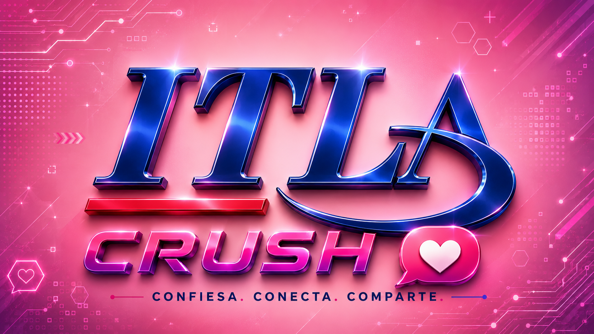

<div align="center">



<p align="center">
  
</p>

Aplicación web para publicar y consultar confesiones públicas, privadas o anónimas, desarrollada con **React**, **Vite** y **Google Firebase**.

<p align="center">
  
  
  
  
</p>

<p align="center">
  <a href="https://github.com/Jairo0811/ITLAcrushReact/actions/workflows/ci.yml">
    
  </a>
</p>

> Estado actual: **Fases 1–4 y 5A–5C completadas**. ITLA Crush ya cuenta con administración, Social Core, quality gates automatizados, verificación técnica de accesibilidad, auditoría de dependencias y presupuestos de bundle. La Fase 5D está preparada para el despliegue en Firebase Hosting y su cierre depende del release real y del smoke test posterior.

</div>

---

## 📌 Descripción

**ITLA Crush** fue concebido originalmente como proyecto final de la asignatura **Programación WEB (SOF-011)** del Instituto Tecnológico de Las Américas (ITLA).

La aplicación permite a los usuarios publicar declaraciones dirigidas a otras personas. Cada confesión puede configurarse como:

- Pública o privada.
- Anónima o identificada.
- Dirigida a un usuario registrado o a una persona introducida manualmente.

Esta reconstrucción se desarrolla desde cero con las tecnologías requeridas originalmente por el profesor: **JavaScript ES6, React y Firebase**. El objetivo es conservar la esencia del proyecto original y llevarlo a un nivel más moderno, mantenible y adecuado para portafolio.

---

## 🎓 Información académica

| Campo | Información |
|---|---|
| **Institución** | Instituto Tecnológico de Las Américas (ITLA) |
| **Asignatura** | Programación WEB |
| **Código** | SOF-011 |
| **Cuatrimestre** | 2018-C2 |
| **Profesor** | Raydelto Hernández Perera |
| **Modalidad** | Proyecto final grupal |

### 👥 Equipo académico original

| 👤 Integrante | 🆔 Matrícula |
|---|---|
| 👨🏻‍💻 Juan Alberty Fernández Durán | 2015-2724 |
| 👨🏻‍💻 Wilmer Vásquez de León | 2015-2946 |
| 👨🏻‍💻 Francis Jairo Matías Rosario | 2015-2984 |
| 👨🏻‍💻 Gerson Santos Mateo | 2015-3031 |

---

## 🧭 Continuidad académica

**ITLA Crush** representa la tercera etapa de una trayectoria académica de tres asignaturas cursadas con el profesor **Raydelto Hernández Perera** en el Instituto Tecnológico de Las Américas (ITLA). La relación entre estos proyectos es **formativa y cronológica**: cada uno corresponde a una asignatura y propósito diferentes, por lo que no constituyen dependencias técnicas ni secuelas funcionales de una misma aplicación.

La trayectoria comenzó en **2017-C2** con **Programación II (SOF-004)** y [**Eventix**](https://github.com/Jairo0811/Eventix). Continuó en **2018-C1** con **Estructuras de Datos (SOF-012)** y [**Aerolinea**](https://github.com/Jairo0811/Aerolinea), y culminó en **2018-C2** con **Programación WEB (SOF-011)**, donde ITLA Crush fue planteado como proyecto final.

| Orden | Código | Asignatura | Proyecto | Período | Enfoque académico |
|---:|---|---|---|---|---|
| 1 | SOF-004 | Programación II | [**Eventix**](https://github.com/Jairo0811/Eventix) | 2017-C2 | Programación orientada a objetos, lógica de negocio y construcción de una aplicación completa |
| 2 | SOF-012 | Estructuras de Datos | [**Aerolinea**](https://github.com/Jairo0811/Aerolinea) | 2018-C1 | Estructuras de datos, modelado de relaciones y resolución de rutas |
| 3 | SOF-011 | Programación WEB | **ITLA Crush** | 2018-C2 | Desarrollo web, JavaScript, React, Firebase y experiencia de usuario basada en interacción social |

Vistos en conjunto, los tres proyectos documentan una progresión desde aplicaciones orientadas a objetos, pasando por estructuras y algoritmos, hasta el desarrollo web moderno. ITLA Crush cierra esa trayectoria trasladando el aprendizaje hacia una aplicación web interactiva con autenticación, persistencia en la nube y componentes reutilizables.

Cada repositorio conserva su identidad académica original y, cuando aplica, incorpora una restauración o modernización posterior orientada a estándares profesionales y portafolio.

---

## 🎯 Objetivos

### Objetivo general

Desarrollar una aplicación web interactiva con React y Firebase que permita registrar usuarios, autenticar sesiones y publicar confesiones públicas, privadas o anónimas.

### Objetivos específicos

- Implementar registro e inicio de sesión.
- Permitir la consulta pública de confesiones visibles para todos.
- Restringir el contenido privado a usuarios autenticados.
- Permitir publicaciones anónimas o identificadas.
- Validar correctamente los formularios y datos ingresados.
- Construir una interfaz moderna, responsive y accesible.
- Organizar el código mediante componentes, servicios y responsabilidades separadas.

---

## 🧪 Demo vs aplicación real

Para evitar confusiones entre contenido de ejemplo y datos reales, el proyecto separa explícitamente ambos entornos:

- **`/demo`**: demostración visual pública con datos ficticios locales. No requiere autenticación y no escribe ni modifica información en Firebase.
- **`/app`**: aplicación real protegida, conectada a Firebase Authentication y Cloud Firestore.
- La interfaz de demostración muestra avisos visibles de **MODO DEMO** y deshabilita acciones simuladas.
- La landing identifica por separado el feed público real y el acceso a la demo.

Esta separación también refuerza el carácter académico del proyecto y evita que usuarios interpreten datos simulados como publicaciones reales.

---
## ♿ Accesibilidad y NORTIC B2

Como parte de la modernización del proyecto, ITLA Crush adopta de forma **voluntaria** una base de accesibilidad inspirada en la **NORTIC B2:2017 — Norma sobre Accesibilidad Web del Estado Dominicano**, con objetivo técnico de cubrir los criterios A y AA que resulten aplicables.

Esto **no implica certificación oficial** ni debe interpretarse como un producto o servicio institucional del ITLA. ITLA Crush continúa siendo un proyecto final académico independiente.

La política, alcance, controles implementados y verificaciones pendientes se documentan en [`docs/NORTIC_B2_ACCESSIBILITY.md`](docs/NORTIC_B2_ACCESSIBILITY.md).

---

## 🚦 Estado del proyecto

| Área | Estado |
|---|---|
| Definición funcional y alcance | ✅ Completados |
| Identidad visual y responsive | ✅ Implementados |
| React + Vite | ✅ Implementados |
| Firebase Authentication — email/contraseña | ✅ Implementado |
| Firebase Authentication — Microsoft | ✅ Integrado; cuentas institucionales pueden requerir aprobación administrativa del tenant |
| Persistencia con Cloud Firestore | ✅ Implementada |
| Confesiones públicas y privadas | ✅ Implementadas |
| Publicación anónima o identificada | ✅ Implementada |
| Trazabilidad interna de autor | ✅ Implementada sin exponer el UID en el documento público |
| Historial de mis confesiones | ✅ Implementado |
| Reglas e índices de Firestore | ✅ Definidos y desplegados |
| Dashboard y perfil | ✅ Implementados |
| Centro de administración | ✅ Monitoreo, gestión de cuentas, roles, estados y auditoría implementados en `/admin` |
| Trust & Safety | ✅ Reportes, ocultamiento y moderación implementados |
| Social Core | ✅ Reacciones, comentarios, favoritos, guardados, compartir y notificaciones |
| Demo separada de la aplicación real | ✅ `/demo` vs `/app` |
| Accesibilidad / NORTIC B2 | ✅ Quality gates automáticos y checklist manual; alineación voluntaria, sin certificación oficial |
| CI | ✅ Audit, lint, tests, a11y, build, bundle budget y Lighthouse |
| Pruebas automatizadas de comportamiento/contrato | ✅ Node Test Runner |
| Optimización de bundle / code splitting | ✅ Vite 8/Rolldown + presupuesto automático |
| Preparación para producción | 🚧 Fase 5D preparada; pendiente despliegue y smoke test |

La aplicación ya cubre su flujo funcional principal. Los trabajos restantes se concentran en **hardening**, pruebas, accesibilidad verificable, optimización del bundle y preparación para despliegue/portafolio.

### 🗺️ Fases de modernización

| Fase | Alcance | Estado |
|---:|---|---|
| 1 | Fundación, UI e identidad visual | ✅ Completada |
| 2 | Identidad y Firebase Authentication | ✅ Completada |
| 3 | Crush Core y Cloud Firestore | ✅ Completada |
| 4 | Trust & Safety, accesibilidad base y separación demo/real | ✅ Completada |
| 5A | Administración, monitoreo y auditoría | ✅ Completada |
| 5B | Social Core: reacciones, comentarios, favoritos, guardados, compartir y notificaciones | ✅ Completada |
| 5C | QA, accesibilidad verificable y rendimiento | ✅ Completada |
| 5D | Firebase Hosting, configuración de producción, release runbook y cierre | 🚧 Preparada para despliegue |

---

## 🚀 Funcionalidades actuales

### 🌐 Visitantes

- Acceder a la landing pública en `/home`.
- Explorar una demo aislada en `/demo` con contenido ficticio.
- Consultar el feed público real cuando Firestore lo permite.
- Crear una cuenta.
- Iniciar sesión mediante email/contraseña.
- Iniciar el flujo OAuth de Microsoft.
- Recuperar la contraseña.
- Consultar términos, privacidad y normas de la comunidad.

### 🔐 Usuarios autenticados

- Acceder al dashboard real en `/app`.
- Crear confesiones públicas o privadas.
- Publicar de forma anónima o identificada.
- Mantener la relación interna entre autor y confesión sin exponerla públicamente.
- Consultar sus propias confesiones.
- Retirar sus propias publicaciones mediante borrado lógico.
- Buscar contenido del feed.
- Ocultar publicaciones de su propio feed.
- Reportar publicaciones por motivos estructurados.
- Consultar y cerrar su sesión desde el perfil.

### 💗 Social Core

Las cuentas autenticadas cuentan con interacciones sociales persistentes respaldadas por Cloud Firestore:

- Reacciones tipo corazón sobre confesiones públicas.
- Comentarios persistentes con nombre visible y tecnólogo del autor.
- Favoritos derivados de las reacciones propias.
- Guardados privados por usuario.
- Compartir mediante Web Share API cuando está disponible o copia de enlace como fallback.
- Enlaces profundos al feed mediante `/app?confession={id}`.
- Notificaciones de reacciones y comentarios recibidos en confesiones propias.
- Rutas protegidas `/favoritos`, `/guardados` y `/notificaciones`.
- Separación de metadatos internos de autoría para comentarios y reacciones cuando aplica.

La interfaz ya no presenta contadores ficticios de mensajes/notificaciones ni accesos a mensajería privada sin implementar. La mensajería directa queda fuera del alcance obligatorio de esta restauración académica.

La arquitectura, colecciones y reglas de esta fase se documentan en [`docs/SOCIAL_CORE.md`](docs/SOCIAL_CORE.md).

### 🛡️ Moderación

Las cuentas con rol `moderator` o `admin` pueden:

- Revisar la cola de reportes.
- Marcar reportes como `open`, `reviewing`, `resolved` o `dismissed`.
- Cambiar el estado de una confesión entre `active`, `under_review` y `removed`.
- Registrar notas internas y trazabilidad de las acciones de moderación.
- Trabajar sin revelar públicamente la identidad de autores anónimos.

### 🧭 Administración y monitoreo

Las cuentas con rol `admin` disponen de un Centro de Administración separado en `/admin` con:

- Métricas agregadas de usuarios, confesiones, reportes y casos de moderación.
- Estado de cuentas activas/restringidas y composición del equipo interno.
- Monitoreo de confesiones públicas, privadas, anónimas, en revisión y retiradas.
- Actividad reciente de usuarios, contenido y reportes.
- Gestión de roles `student`, `moderator` y `admin`.
- Suspensión, bloqueo y reactivación de cuentas.
- Bitácora administrativa inmutable para cambios de rol y estado.
- Aplicación en tiempo real del estado de cuenta dentro de la interfaz protegida.
- Enlace directo a la cola operativa de `/moderacion`.
- Separación estricta entre monitoreo administrativo y experiencia normal de usuario.

El administrador inicial sigue requiriendo aprovisionamiento confiable fuera del frontend. Una vez existe al menos una cuenta `admin`, la gestión operativa de acceso puede realizarse desde `/admin`. Más detalles en [`docs/ADMIN_MONITORING.md`](docs/ADMIN_MONITORING.md).

### 🧪 Demo vs aplicación real

| Ruta | Propósito | Datos |
|---|---|---|
| `/demo` | Demostración pública de la interfaz | Ficticios y locales; no escribe en Firebase |
| `/app` | Aplicación funcional | Reales; protegidos por autenticación y reglas de Firestore |

La demo incluye avisos persistentes de **MODO DEMO**, etiquetas de contenido ficticio y acciones simuladas deshabilitadas para evitar confusión con la aplicación real.

---

## 🧱 Stack tecnológico

### 🎨 Frontend

<p>
  
</p>

- **React:** construcción de interfaces mediante componentes reutilizables.
- **React Router DOM:** navegación SPA y protección de rutas.
- **JavaScript ES6+:** lógica del cliente, validaciones y gestión del estado.
- **HTML5:** estructura semántica.
- **CSS3:** diseño visual y comportamiento responsive.

### 🔥 Backend y persistencia

<p>
  
</p>

- **Firebase Authentication:** registro, inicio de sesión y administración de sesiones.
- **Cloud Firestore:** persistencia NoSQL de usuarios y confesiones.
- **Reglas de seguridad:** control de acceso a los datos almacenados.
- **Variables de entorno:** configuración segura de Firebase.

### 🧰 Herramientas de desarrollo

<p>
  
</p>

- **Vite:** servidor de desarrollo y compilación.
- **npm:** administración de dependencias y scripts.
- **Visual Studio Code:** entorno de desarrollo recomendado.
- **Git y GitHub:** control de versiones y publicación del código fuente.

---

## 🏗️ Arquitectura

```text
src/
├── assets/
├── components/
│   ├── common/
│   ├── confession/
│   └── layout/
├── context/
├── hooks/
├── pages/
├── routes/
├── services/
├── styles/
├── utils/
├── App.jsx
└── main.jsx
```

### Responsabilidades principales

| Carpeta | Responsabilidad |
|---|---|
| `components/` | Componentes visuales reutilizables. |
| `context/` | Estado global relacionado con autenticación. |
| `hooks/` | Lógica reutilizable mediante hooks personalizados. |
| `pages/` | Vistas asociadas a las rutas. |
| `routes/` | Configuración y protección de rutas. |
| `services/` | Integración con Firebase y operaciones de datos. |
| `styles/` | Variables y estilos globales. |
| `utils/` | Validaciones, formateadores y funciones auxiliares. |

---

## 🗄️ Modelo de datos actual

### `users/{uid}`

Perfil del usuario autenticado: nombre visible, correo, tecnólogo, proveedor de autenticación, rol, estado y aceptación de términos.

### `confessions/{confessionId}`

Documento visible según permisos. Contiene el texto, destinatario, visibilidad, modo anónimo/identificado, datos públicos del autor cuando aplica, etiquetas, estado y contadores.

### `confessionAuthors/{confessionId}`

Relación privada entre la confesión y el `authorUid`. Permite trazabilidad y autorización sin incluir el UID en el documento público.

### Trust & Safety

- `reports/{confessionId}_{reporterUid}`: reportes únicos por usuario y confesión.
- `hiddenConfessions/{ownerUid}_{confessionId}`: contenido oculto solo para una cuenta.
- `moderationCases/{confessionId}`: metadatos internos de moderación separados del contenido público.
- `socialActivity/{activityId}`: reacciones y comentarios visibles asociados a confesiones públicas.
- `reactionOwners/{confessionId_uid}`: relación privada para garantizar una reacción por usuario y confesión.
- `commentAuthors/{commentId}`: trazabilidad privada de autoría de comentarios.
- `savedConfessions/{uid_confessionId}`: guardados privados por usuario.
- `adminAuditLogs/{auditId}`: bitácora inmutable de cambios administrativos sobre roles y estados de cuenta.

El modelo aplica el principio de que **anónimo para la comunidad no significa anónimo para el sistema**.

---

## 🔄 Flujo general

1. El visitante entra a la landing o explora la demo aislada.
2. Para usar la aplicación real crea una cuenta o inicia sesión.
3. El usuario autenticado redacta una confesión y define su visibilidad.
4. Decide si publica de forma anónima o identificada.
5. Firestore guarda de forma atómica la confesión y su relación privada de autoría.
6. El feed muestra únicamente contenido permitido por las reglas y el estado de moderación.
7. El usuario puede ocultar o reportar contenido.
8. Moderación puede revisar los casos sin convertir la identidad interna del autor en información pública.

---

## ⚙️ Requisitos previos

- Node.js 18 o superior.
- npm.
- Una cuenta de Google Firebase.
- Un proyecto web configurado en Firebase.

Verifica las versiones instaladas:

```bash
node -v
npm -v
```

---

## 📦 Instalación

Desde la carpeta raíz del proyecto, instala las dependencias:

```bash
npm install
```

---

## 🔥 Configuración de Firebase

Crea un archivo `.env` en la raíz del proyecto:

```env
VITE_FIREBASE_API_KEY=
VITE_FIREBASE_AUTH_DOMAIN=
VITE_FIREBASE_PROJECT_ID=
VITE_FIREBASE_STORAGE_BUCKET=
VITE_FIREBASE_MESSAGING_SENDER_ID=
VITE_FIREBASE_APP_ID=
```

Las variables se obtienen desde la configuración de la aplicación web creada en Firebase Console.

> El archivo `.env` no debe incluirse en el repositorio. Se recomienda proporcionar un archivo `.env.example` sin valores sensibles.

También será necesario habilitar:

- **Authentication → Email/Password**.
- **Cloud Firestore**.

---

## ▶️ Ejecución en desarrollo

```bash
npm run dev
```

Vite mostrará en la terminal la dirección local de la aplicación, normalmente:

```text
http://localhost:5173
```

### 📱 Acceso desde un móvil en la red local

El servidor de Vite está configurado para escuchar en `0.0.0.0:5173`. Con la PC y el móvil conectados a la misma red Wi-Fi/LAN:

1. Obtén la IPv4 de la PC con `ipconfig` en Windows.
2. Mantén `npm run dev` ejecutándose.
3. Abre en el navegador del móvil `http://<IP-DE-LA-PC>:5173`.

Ejemplo:

```text
http://192.168.1.50:5173
```

Si Windows solicita acceso de firewall para Node.js, permite únicamente redes privadas.

---

## ✅ Quality gates — Fase 5C

La Fase 5C añade controles reproducibles para evitar regresiones antes de fusionar cambios a `main`.

```bash
npm run audit:prod
npm run lint
npm test
npm run check:a11y
npm run build
npm run check:bundle
```

También se ejecuta **Lighthouse CI** sobre `/home`, `/demo` y `/login`, con accesibilidad >= 0.90 como condición obligatoria.

El build utiliza code splitting de Vite 8/Rolldown para separar Firebase, React y otras dependencias del código principal, y `npm run check:bundle` impide reintroducir chunks JavaScript por encima del presupuesto definido.

La guía completa de QA, accesibilidad y rendimiento está en [`docs/QA_ACCESSIBILITY_PERFORMANCE.md`](docs/QA_ACCESSIBILITY_PERFORMANCE.md).

> Estas verificaciones apoyan la alineación voluntaria con NORTIC B2. No sustituyen una evaluación/certificación oficial ni las pruebas manuales complementarias de teclado, zoom y lector de pantalla.

---

## 🌐 Despliegue de producción

La Fase 5D incorpora configuración de **Firebase Hosting** para servir el build de Vite como SPA, incluyendo reescritura de rutas internas hacia `/index.html`, cache de assets versionados y cabeceras HTTP básicas de seguridad.

Scripts disponibles:

```bash
npm run deploy:firestore
npm run deploy:hosting
npm run deploy:prod
```

El release completo valida lint + build antes de desplegar reglas/índices de Firestore y Hosting.

La guía detallada de configuración, dominios autorizados, Microsoft Entra, smoke tests y rollback se encuentra en [`docs/PRODUCTION_DEPLOYMENT.md`](docs/PRODUCTION_DEPLOYMENT.md).

URLs previstas para Firebase Hosting:

```text
https://itla-crush-cb9bd.web.app
https://itla-crush-cb9bd.firebaseapp.com
```

> La existencia de estas URLs en la documentación no sustituye la verificación de un despliegue exitoso. El release debe probarse después de ejecutar Firebase CLI.

---

## 🏗️ Compilación para producción

Generar la versión optimizada:

```bash
npm run build
```

Probar localmente la compilación:

```bash
npm run preview
```

---

## 📏 Alcance

El sistema cubrirá el registro y autenticación de usuarios, la creación de confesiones, la selección de destinatarios y la consulta de contenido público o privado según los permisos establecidos.

La reconstrucción mantiene el propósito académico del proyecto original y evoluciona hacia una implementación moderna orientada a portafolio. **No es una aplicación oficial del ITLA**, ni representa un producto, servicio o canal institucional de esa entidad.

---

## 🎓 Contexto académico

Proyecto inspirado en la propuesta final de **Programación WEB (SOF-011)** del Instituto Tecnológico de Las Américas, correspondiente al cuatrimestre **2018-C2**.

La nueva implementación busca representar cómo habría quedado ITLA Crush si hubiese sido desarrollado completamente con **React y Firebase**, según las tecnologías indicadas para la asignatura.