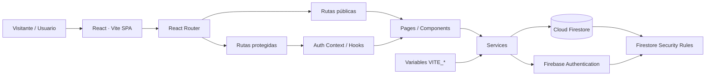
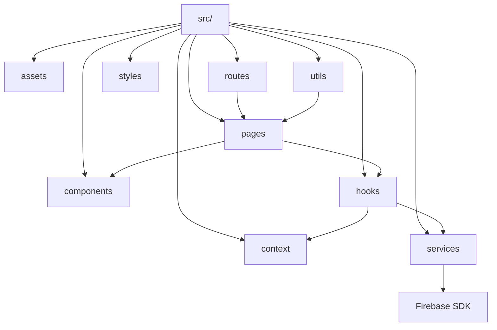
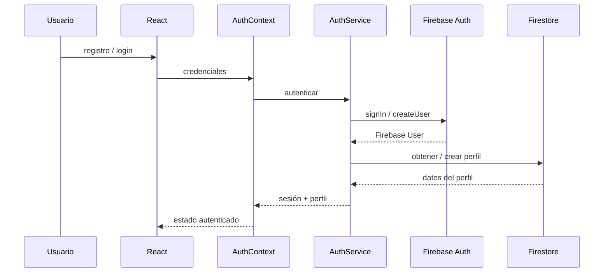
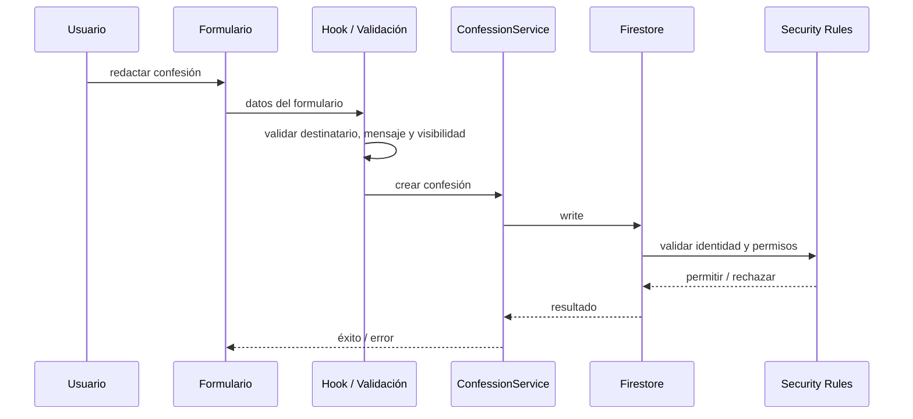
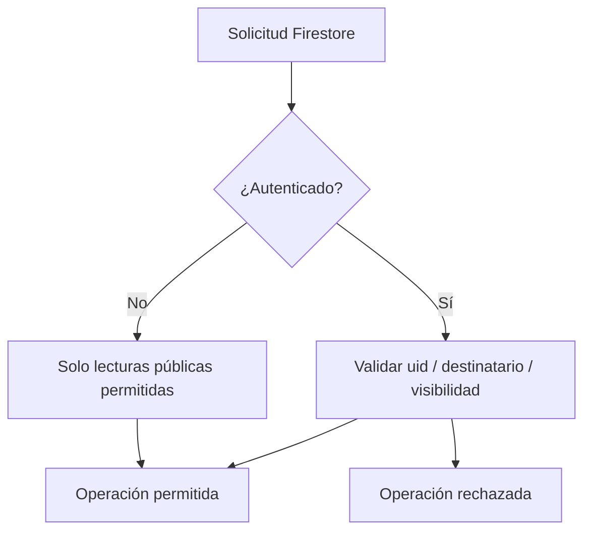

# Arquitectura de ITLA Crush React

ITLA Crush está siendo reconstruido como una **SPA modular con React y Firebase**. La arquitectura objetivo mantiene la interfaz desacoplada de Firebase mediante contextos, hooks y servicios, de forma que autenticación, persistencia y reglas de acceso no queden dispersas entre componentes visuales.

> El repositorio continúa en desarrollo. Este documento describe la arquitectura objetivo que debe guiar la implementación restante.

## Vista general

La SPA no debe acceder a Firebase desde componentes arbitrarios. Los servicios encapsulan operaciones remotas; el contexto de autenticación mantiene la sesión; las reglas de Firestore constituyen la última frontera de autorización sobre los datos.

## Organización del frontend

| Carpeta | Responsabilidad |
|---|---|
| `components/` | Componentes visuales reutilizables y sin lógica de persistencia directa |
| `context/` | Estado global de autenticación y sesión |
| `hooks/` | Lógica reutilizable y adaptación entre UI y servicios |
| `pages/` | Composición de vistas asociadas a rutas |
| `routes/` | Declaración y protección de navegación |
| `services/` | Integración con Firebase Authentication y Firestore |
| `styles/` | Tokens, estilos globales y comportamiento responsive |
| `utils/` | Validaciones, normalización y funciones auxiliares |

## Autenticación

El UID de Firebase es el identificador técnico de la cuenta. Los datos públicos o de perfil complementarios deben almacenarse en Firestore y recuperarse mediante el servicio correspondiente.

## Publicación de confesiones

Las opciones pública/privada y anónima/identificada afectan la representación y consulta, pero no deben permitir que el cliente suplante a otro autor. El autor real se deriva siempre del usuario autenticado.

## Modelo de acceso

Las **Firestore Security Rules** son obligatorias. Ocultar una vista en React no constituye autorización.

## Dependencias

- React y React Router controlan composición y navegación.
- Firebase SDK permanece detrás de `services/`.
- Los componentes consumen hooks/contextos en lugar de acceder directamente a la infraestructura.
- Las variables de entorno configuran el proyecto Firebase, pero no reemplazan reglas de seguridad.
- La persistencia se concentra en Cloud Firestore; la autenticación en Firebase Authentication.

## Criterio de evolución

Mientras el alcance sea una SPA académica con backend administrado, Firebase es suficiente. Si el dominio creciera hacia moderación compleja, auditoría, procesamiento asíncrono o reglas empresariales sensibles, esas capacidades deberían pasar a funciones/backend confiable en lugar de ejecutarse únicamente en el navegador.
